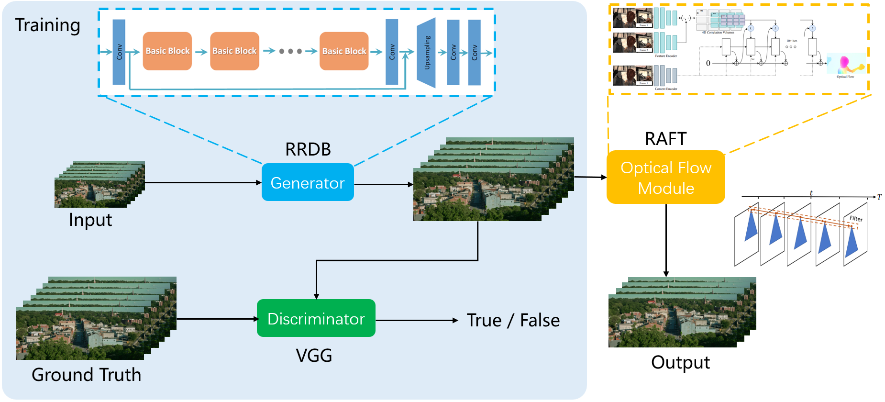
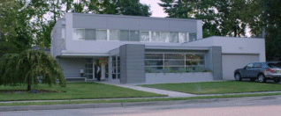

Video Super-Resolution GAN
=================
A generative method for video super-resolution which using the motion filter to make the results more stable.

Pipeline
-----------------


Dependencies
-----------------
- numpy==1.22.4
- opencv_python==4.5.4.60
- Pillow==9.1.1
- scipy==1.8.1
- torch==1.8.0
- torchvision==0.9.0
- tqdm==4.64.0


Test Model
-----------------
```bash
python demo.py --test_dir your_path --out_dir your_path
```
You can also use a bash script to run the demo as exampled in 'run.sh'.

Pretrained Models Download
-----------------
The pretrained model can be download from google drive.
- [GAN](https://drive.google.com/drive/folders/17VYV_SoZZesU6mbxz2dMAIccSSlqLecY)
- [RAFT](https://drive.google.com/drive/folders/1sWDsfuZ3Up38EUQt7-JDTT1HcGHuJgvT?usp=sharing)

Remeber to use the command line arguments to locate the models.
```bash
python demo.py --gen_model your_path --raft_model your_path
```

Dataset Download
-----------------
Following ESRGAN, we use [DIV2K](https://data.vision.ee.ethz.ch/cvl/DIV2K/) and [Flick2K](http://cv.snu.ac.kr/research/EDSR/Flickr2K.tar) to train the model.

The evaluation dataset can be download from baidu drive, and we use [val.zip](https://pan.baidu.com/s/1TNtkn_dHHQf_3_JABKWgZg#list/path=%2F) (password: pr7p) in our experiments. Don't forget to set --test_dir for demo.py.


Quantitative Results
-----------------
The results are obtained from the 20 videos in val.zip.
| PSNR | SSIM | NIQE |
|------|------|------|
| 0.00 | 0.00 | 0.00 |


Visual Results
-----------------
- Low Resolution



- High Resolution


- Low Resolution


- High Resolution


- Low Resolution


- High Resolution


Acknowledge
-----------------
- [RAFT](https://github.com/princeton-vl/RAFT)
- [BasicSR](https://github.com/XPixelGroup/BasicSR)
- [ESRGAN](https://github.com/xinntao/ESRGAN)
- [MSHPFNL](https://github.com/psychopa4/MSHPFNL)